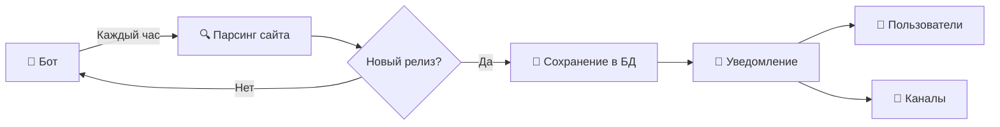

# 🍎 macOS Update Checker Bot

Telegram-бот для автоматического отслеживания новых релизов macOS Sequoia с сайта [Mr. Macintosh](https://mrmacintosh.com/).

## 🚀 Как это работает



## ✨ Возможности

- 🔍 Автоматический мониторинг страницы с релизами macOS Sequoia
- 🔔 Мгновенные уведомления о новых версиях (Public и Beta)
- 📊 Детальная информация о каждом релизе (версия, build, ссылка на скачивание)
- 🛡️ Whitelist пользователей для защиты от несанкционированного доступа
- 📢 Поддержка каналов для массовых уведомлений
- 💾 SQLite база данных для хранения истории релизов
- 🐳 Docker контейнер для удобного развертывания

## 📋 Требования

- Python 3.10+
- Telegram бот (создается через [@BotFather](https://t.me/BotFather))
- Docker и Docker Compose (опционально)

## ⚡ Быстрый старт

### 1️⃣ Создание Telegram бота

1. Напишите [@BotFather](https://t.me/BotFather) в Telegram
2. Отправьте команду `/newbot`
3. Следуйте инструкциям и получите токен бота
4. Сохраните токен - он понадобится для настройки

### 2️⃣ Узнайте свой Telegram ID

1. Напишите [@userinfobot](https://t.me/userinfobot)
2. Бот отправит вам ваш ID
3. Сохраните этот ID

### 3️⃣ Настройка для канала (опционально)

Если хотите отправлять уведомления в канал:

1. Создайте канал в Telegram
2. Добавьте вашего бота в канал как администратора с правом отправки сообщений
3. Чтобы узнать ID канала:
   - Перейдите в веб-версию Telegram
   - Откройте канал
   - ID канала будет в URL (например: `-1001234567890`)

### 4️⃣ Установка

#### 🐳 Вариант А: Docker (рекомендуется)

```bash
# Клонируйте репозиторий
git clone https://github.com/nimbo78/macos_update_checker.git
cd macos_update_checker

# Создайте конфигурационный файл
cp config.py.example config.py

# Отредактируйте config.py, укажите:
# - BOT_TOKEN
# - NOTIFICATION_TARGETS (ваш ID и/или ID канала)
# - ALLOWED_USER_IDS (ваш ID)
# - ADMIN_USER_IDS (ваш ID)

# Запустите с помощью Docker Compose
docker-compose up -d

# Просмотр логов
docker-compose logs -f
```

#### 🐍 Вариант Б: Без Docker

```bash
# Клонируйте репозиторий
git clone https://github.com/nimbo78/macos_update_checker.git
cd macos_update_checker

# Создайте виртуальное окружение
python -m venv venv
source venv/bin/activate  # На Windows: venv\Scripts\activate

# Установите зависимости
pip install -r requirements.txt

# Создайте конфигурационный файл
cp config.py.example config.py

# Отредактируйте config.py

# Запустите бота
python bot.py
```

## ⚙️ Конфигурация

Все настройки находятся в файле `config.py`:

```python
# Токен бота
BOT_TOKEN = "your_bot_token"

# Куда отправлять уведомления
NOTIFICATION_TARGETS = [
    123456789,           # Личный чат
    -1001234567890,      # Канал
]

# Кто может использовать команды
ALLOWED_USER_IDS = [
    123456789,
]

# Администраторы
ADMIN_USER_IDS = [
    123456789,
]

# Интервал проверки (в секундах)
CHECK_INTERVAL = 3600  # 1 час
```

## 🤖 Команды бота

| Команда | Описание | Доступ |
|---------|----------|--------|
| `/start` | Приветствие и список команд | Все |
| `/help` | Справка по использованию | Все |
| `/status` | Статус бота и последняя проверка | Все |
| `/latest` | Последний релиз (Public и Beta) | Все |
| `/myid` | Узнать свой Telegram ID | Все |
| `/check` | Принудительная проверка | 🔐 Админы |

## 📂 Структура проекта

```
macos_update_checker/
├── bot.py              # Основной файл бота
├── scraper.py          # Парсер страницы
├── database.py         # Работа с базой данных
├── config.py.example   # Пример конфигурации
├── requirements.txt    # Python зависимости
├── Dockerfile          # Docker образ
├── docker-compose.yml  # Docker Compose конфигурация
├── .gitignore          # Git ignore
└── README.md           # Документация
```

## 📝 Логи

Логи сохраняются в файл `bot.log` и выводятся в консоль.

```bash
# Docker
docker-compose logs -f

# Последние 50 строк
docker-compose logs --tail=50
```

## 🛑 Остановка бота

```bash
# Docker
docker-compose down

# Без Docker
# Нажмите Ctrl+C в терминале
```

## 🔄 Обновление

**📖 Подробная инструкция:** См. [UPDATE.md](UPDATE.md)

```bash
# Быстрое обновление (Docker)
cd macos_update_checker && git pull && docker-compose down && docker-compose build --no-cache && docker-compose up -d

# Быстрое обновление (Python)
cd macos_update_checker && git pull && source venv/bin/activate && pip install -r requirements.txt --upgrade
```

## 🔧 Troubleshooting

### Бот не отвечает на команды
- Проверьте, что ваш ID добавлен в `ALLOWED_USER_IDS`
- Убедитесь, что бот запущен (`docker-compose ps`)
- Проверьте логи на наличие ошибок

### Не приходят уведомления в канал
- Убедитесь, что бот добавлен в канал как администратор
- Проверьте правильность ID канала в `NOTIFICATION_TARGETS`
- ID канала должен начинаться с `-100`

### Ошибки при парсинге
- Проверьте доступность сайта mrmacintosh.com
- Возможно, изменилась структура страницы - нужно обновить парсер

## 🔒 Безопасность

- ⚠️ **Не коммитьте** файл `config.py` с реальными токенами!
- ✅ Используйте `.gitignore` для исключения чувствительных данных
- 🔄 Регулярно обновляйте зависимости для устранения уязвимостей

## 📄 Лицензия

Apache License 2.0

## 💬 Поддержка

При возникновении проблем создайте [Issue](https://github.com/nimbo78/macos_update_checker/issues) в репозитории проекта.

---

**Создано для мониторинга релизов macOS Sequoia** 🍎
