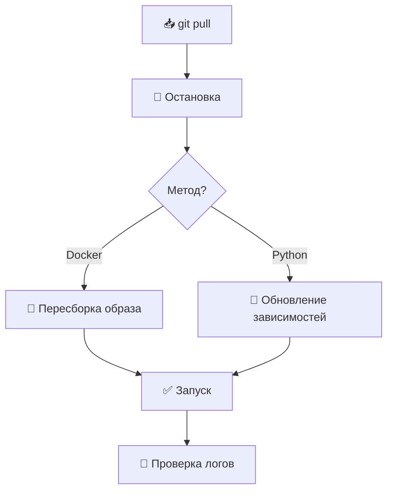

# 🔄 Обновление бота

## 🚀 Процесс обновления



## 🐳 Обновление через Docker (рекомендуется)

```bash
cd macos_update_checker

# 1. Получить обновления с GitHub
git pull

# 2. Остановить контейнер
docker-compose down

# 3. Пересобрать образ
docker-compose build --no-cache

# 4. Запустить
docker-compose up -d

# 5. Проверить логи
docker-compose logs -f
```

**⚡ Быстрый вариант (одной командой):**
```bash
cd macos_update_checker && git pull && docker-compose down && docker-compose build --no-cache && docker-compose up -d
```

## 🐍 Обновление при локальном запуске (Python)

```bash
cd macos_update_checker

# 1. Получить обновления
git pull

# 2. Активировать виртуальное окружение
source venv/bin/activate  # Linux/macOS
# venv\Scripts\activate    # Windows

# 3. Обновить зависимости
pip install -r requirements.txt --upgrade

# 4. Перезапустить бота
# Ctrl+C для остановки, затем:
python bot.py
```

## ⚙️ Обновление при использовании systemd

```bash
cd macos_update_checker

# 1. Получить обновления
git pull

# 2. Обновить зависимости
source venv/bin/activate
pip install -r requirements.txt --upgrade
deactivate

# 3. Перезапустить сервис
sudo systemctl restart macos_update_checker

# 4. Проверить статус
sudo systemctl status macos_update_checker
```

## ⏪ Откат к предыдущей версии

Если что-то пошло не так:

```bash
# Посмотреть последние коммиты
git log --oneline -5

# Откатиться на предыдущую версию
git checkout <commit-hash>

# Пересобрать (Docker)
docker-compose down && docker-compose build --no-cache && docker-compose up -d

# Вернуться на latest
git checkout main  # или master
```

## 💾 Сохранение данных при обновлении

**База данных и логи автоматически сохраняются:**
- 🐳 Docker: в volume `/root/macos_update_checker/data`
- 🐍 Локально: в папке проекта `./data` или `./`

При обновлении эти файлы **не удаляются**.

## ✅ Чеклист после обновления

- [ ] Бот запустился: `docker-compose ps` (Up)
- [ ] Нет ошибок в логах: `docker-compose logs | tail -20`
- [ ] База данных на месте: `ls -lh data/`
- [ ] Команды работают: отправить `/status` в Telegram

## 🤖 Автоматические обновления (опционально)

### Cron для проверки обновлений

```bash
# Редактировать crontab
crontab -e

# Проверять обновления каждый день в 3:00
0 3 * * * cd /root/macos_update_checker && git fetch && [ $(git rev-list HEAD...origin/main --count) -gt 0 ] && git pull && docker-compose down && docker-compose build --no-cache && docker-compose up -d
```

### Watchtower для Docker (автообновление образов)

```yaml
# Добавить в docker-compose.yml
services:
  watchtower:
    image: containrrr/watchtower
    volumes:
      - /var/run/docker.sock:/var/run/docker.sock
    command: --interval 86400 --cleanup
```

## 🔧 Troubleshooting

**⚠️ Конфликты при git pull:**
```bash
# Сохранить локальные изменения
git stash

# Получить обновления
git pull

# Применить локальные изменения обратно
git stash pop
```

**🐳 Ошибка при сборке Docker:**
```bash
# Очистить Docker кэш
docker system prune -a
docker-compose build --no-cache
```

**💾 База данных повреждена:**
```bash
# Бэкап (если возможно)
cp data/macos_releases.db data/macos_releases.db.backup

# Удалить и создать заново (потеря данных!)
rm data/macos_releases.db
docker-compose restart
```
